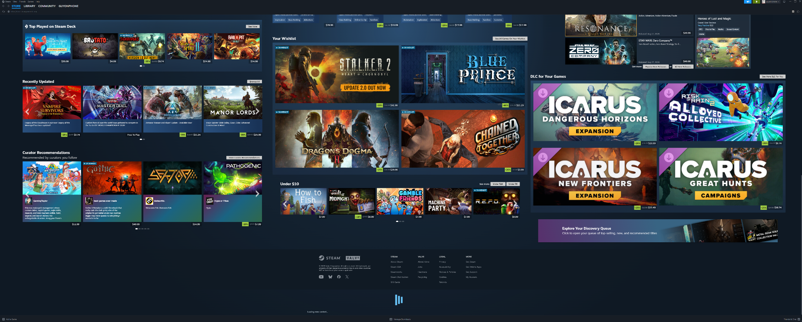
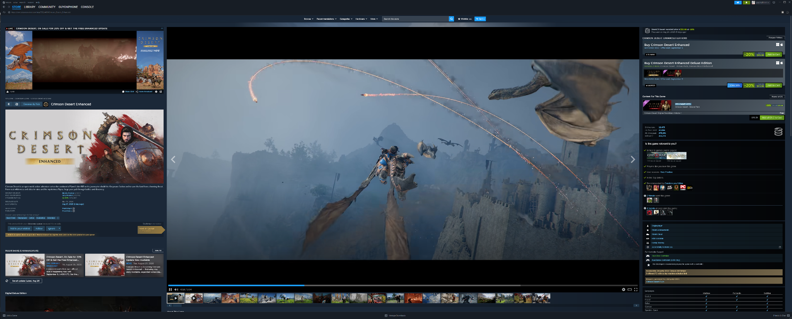

# UltraWide

Got a 4K or ultrawide monitor? Tired of Steam using the middle third of it like the rest of your screen doesn’t exist? Me too.

**UltraWide for Steam** makes the Store actually fit your display, with a three-column homepage, expanded game pages, better purchase placement, and a redesigned review section built for big screens.

**UltraWide** is a Millennium theme for the Steam Store designed for ultrawide and very high-resolution displays.

It expands Steam's Store layouts to make better use of horizontal space while preserving Steam's native functionality and keeping the main Store homepage and individual game pages isolated from one another.



## Features

- Three-lane Steam Store homepage designed for ultrawide displays.
- Expanded individual game Store pages.
- Purchase information is consistently routed to the right-hand column.
- Large in-page Customer Reviews viewport with its own scrollbar.
- Review summary and filter controls remain visible while reviews scroll.
- Review viewport leaves left/right mouse gutters for normal page scrolling.
- Scroll chaining returns to the Steam page when the review viewport reaches its top or bottom.
- **See More Reviews** loads additional reviews inside the page instead of immediately navigating away.
- Steam's full review page remains available through **Open Full Reviews**.
- Steam's review histogram remains interactive and supports hide/show toggling.
- Cold-start handling avoids activating the custom layout before Steam has mounted meaningful Store content.
- Main Store homepage behavior and individual-game behavior are separately scoped.



## Requirements

- [Millennium](https://steambrew.app/)
- Steam desktop client
- A wide display is strongly recommended. UltraWide is specifically designed to make use of screen space that Steam's stock Store layout normally leaves unused.

## Installation

### Through SteamBrew / Millennium

Once UltraWide is approved and listed, install it through Millennium's normal theme interface.

### Manual development installation

Clone or download this repository into your Millennium themes directory, then enable **UltraWide** from Millennium's theme settings.

The repository contains the browser-ready CSS and JavaScript used by the theme; no build or transpilation step is required.

## Repository layout

```text
UltraWide/
├── skin.json      # Millennium metadata and URL patch routing
├── home.css       # Main Steam Store homepage styles
├── home.js        # Main Steam Store homepage behavior
├── webkit.css     # Individual game Store page styles
├── webkit.js      # Individual game Store page behavior
├── README.md
├── CHANGELOG.md
├── LICENSE
└── assets/
    └── screenshots/
```

## Millennium compatibility and design notes

UltraWide uses custom Millennium `Patches` rather than `UseDefaultPatches`. The homepage patch is limited to the Steam Store root, while the app-page patch is limited to numeric `/app/<id>` Store URLs.

The theme is written in vanilla CSS and JavaScript. It does not load third-party JavaScript or CSS, does not implement telemetry or analytics, and does not collect user data.

Where Steam exposes stable structural or semantic hooks, UltraWide prefers those over visible English text. A small number of legacy homepage discovery fallbacks may still inspect headings where Steam does not expose a stable identifier; those paths are isolated and documented in the source.

The individual-game review implementation intentionally leaves Steam in control of its React-owned review cards, graph DOM, hover interactions, filter controls, and native full-review destination. UltraWide manages layout, scrolling, paint order, and additional same-origin Steam review batches around those native elements.

## Current release

**81.0.0**

The v81 release fixes review-histogram paint ordering after a hide/show toggle. Steam's graph remains native and interactive; UltraWide ensures it paints above the pinned-header backing plate and below the pinned controls.

See [CHANGELOG.md](CHANGELOG.md) for recent development history.

## Contributing / bug reports

If you encounter a Steam layout that does not behave correctly, please open a GitHub issue and include:

- the Steam Store URL,
- a screenshot or short recording,
- your display resolution,
- and, when possible, relevant DevTools console/DOM information.

## License

UltraWide is released under the [MIT License](LICENSE).
